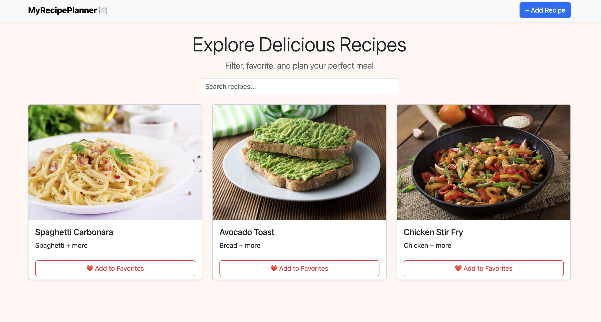
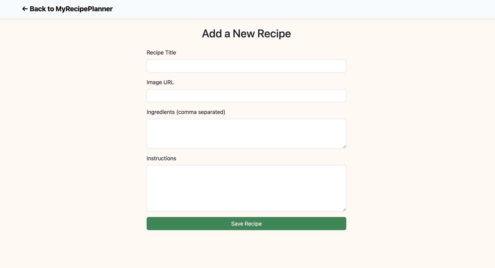
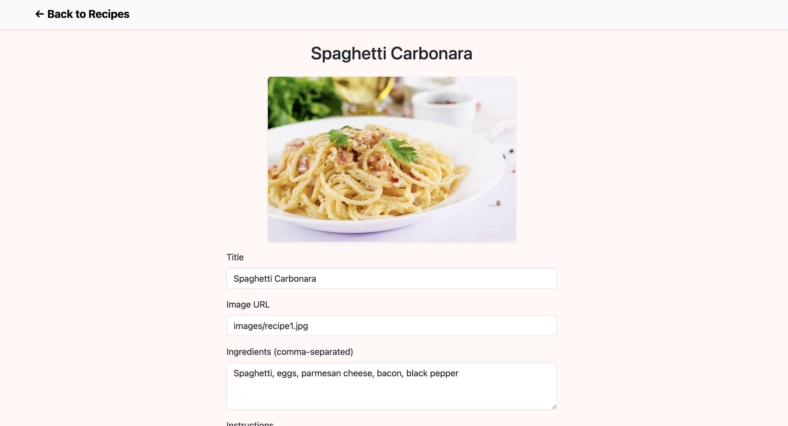

# 🍽️ MyRecipePlanner

MyRecipePlanner is a simple, stylish, and responsive recipe manager that lets users add, view, search, edit, and delete their favorite meals — all stored in their own browser. It was built using HTML, CSS, JavaScript, and Bootstrap.

This project was created as a front-end portfolio piece to demonstrate UI development, responsive design, and dynamic client-side functionality.

---

## 📸 Screenshots

### Homepage

### Add Recipe

### View/Edit Recipe

---

## 🚀 Live Demo

👉 [View it live here](https://taylorbolinger.github.io/my-recipe-planner/)

---

## ✨ Features

- Add new recipes with images, ingredients, and instructions
- Search recipes by name or ingredients
- Edit existing recipes
- Delete recipes with confirmation
- Responsive card layout for mobile/tablet/desktop
- Custom styling on top of Bootstrap
- Demo recipes on first visit
- All data saved locally using `localStorage`

---

## 🛠️ Tech Stack

- HTML
- CSS (custom + Bootstrap 5)
- JavaScript 
- GitHub Pages for deployment

---

## 📌 Next Steps

I plan to continue improving this project by adding:
- ❤️ Favorite toggle + filter
- ⭐ Recipe rating system
- 🌓 Light/dark mode toggle
- 🏷️ Tags for filtering recipes
- 🔒 Optional login with a real backend (TBD)

---

